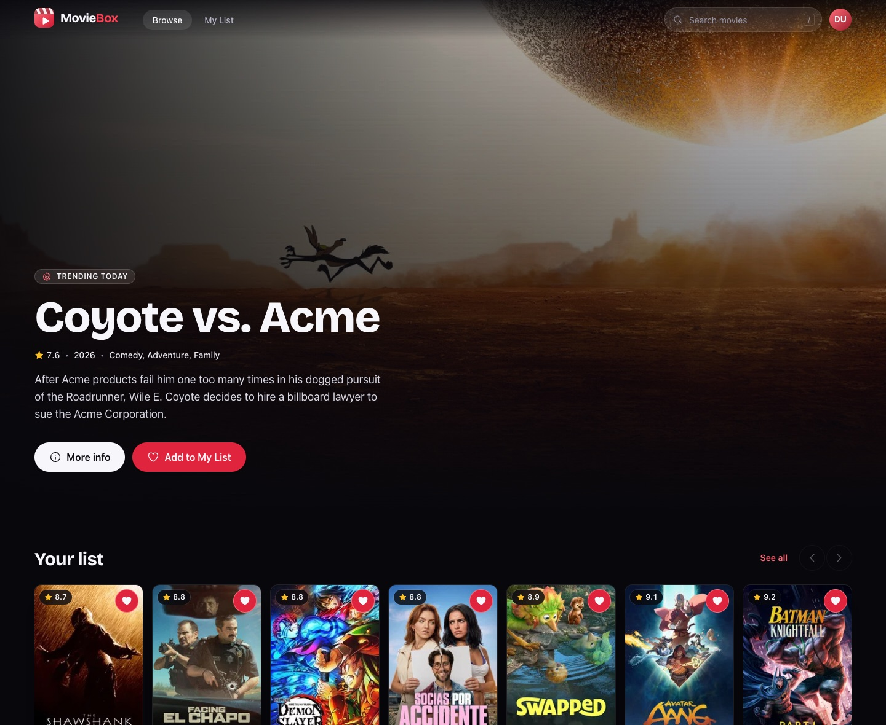
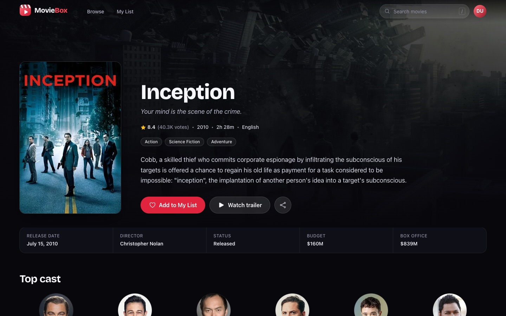
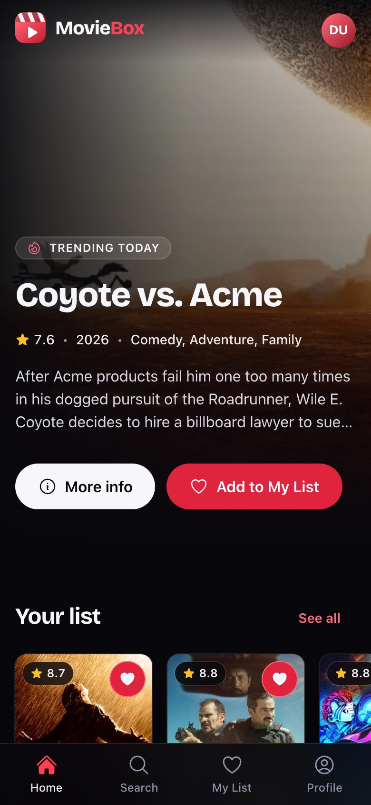
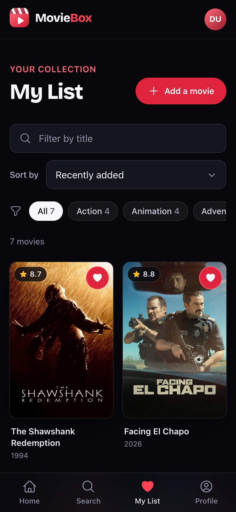
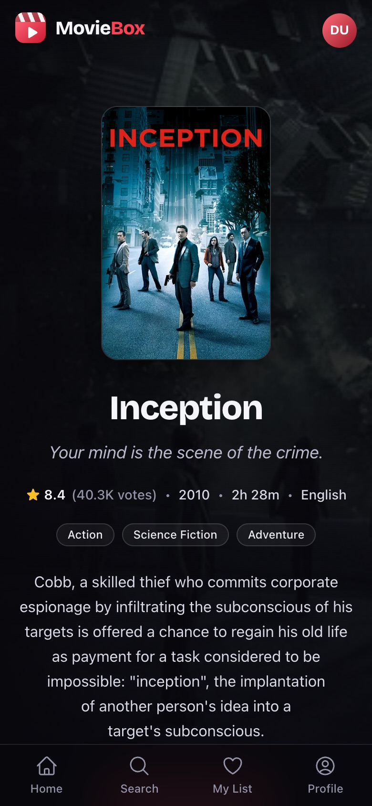

# MovieBox

Discover popular, top rated and upcoming movies, watch trailers, and keep a personal watchlist.

**[Live site](https://moviebox-0lid.onrender.com/)** · **[Source code](https://github.com/bensuz/MovieBox)**



## Table of contents

-   [Overview](#overview)
-   [Functionality](#functionality)
-   [Built with](#built-with)
-   [Performance, accessibility and SEO](#performance-accessibility-and-seo)
-   [What I learned](#what-i-learned)
-   [Getting started](#getting-started)
-   [Screenshots](#screenshots)
-   [Author](#author)

## Overview

**MovieBox** is a full-stack CRUD web application for discovering movies and managing a personal watchlist. It pulls the live catalog from TMDB, and signed-in users can save movies, add ones that aren't in the catalog, and edit or remove anything on their list.

Version 2 is a complete front-end redesign focused on modern UI and UX, accessibility and performance.

### Functionality

Users can:

-   Browse popular, top rated, now playing and upcoming movies, with pagination
-   Search the full TMDB catalog, or press <kbd>/</kbd> anywhere to jump to search
-   Open a movie to see its overview, cast, facts, trailer and recommendations
-   Create an account, sign in, and upload or remove a profile photo
-   Save any movie to **My List** in one tap, with instant feedback and **Undo**
-   Filter, search and sort their list; filters are kept in the URL
-   Add their own movies (with a live poster preview) and edit or delete saved ones
-   Use the app comfortably on any screen size, with a bottom tab bar on phones

### Built with

**Front end**

-   [React 19](https://react.dev/): `useOptimistic` and `useTransition` for list updates, native document metadata (`<title>`, `<meta>`) per page
-   [React Router 7](https://reactrouter.com/), with route-based code splitting
-   [Tailwind CSS 4](https://tailwindcss.com/), using a custom design token system
-   [Vite 8](https://vite.dev/)
-   Native `<dialog>` and Popover API for modals and menus (no UI library)
-   [Heroicons](https://heroicons.com/) and [Sonner](https://sonner.emilkowal.ski/) for toasts
-   ESLint with the strict `jsx-a11y` ruleset

**Back end**

-   Node.js and Express, with response compression and an in-memory TMDB cache
-   PostgreSQL
-   JSON Web Token (JWT) authentication with HTTP-only cookies and salted password hashing
-   Cloudinary for avatar uploads
-   [TMDB API](https://developer.themoviedb.org/) and the YouTube Data API v3 (trailer fallback)
-   Deployed on Render

### Performance, accessibility and SEO

Lighthouse scores for the production build (mobile uses Lighthouse's default throttled Moto G profile):

| Pages                        | Performance | Accessibility | Best Practices | SEO |
| ---------------------------- | :---------: | :-----------: | :------------: | :-: |
| Public pages, mobile         |   95–98     |      100      |      100       | 100 |
| Public pages, desktop        |   99–100    |      100      |      100       | 100 |

Signed-in pages also score 100 for Accessibility and Best Practices. They, along with search results and the 404 page, are deliberately excluded from search engines with `noindex`.

How it gets there:

-   **Lean bundle:** about 110 kB of gzipped JavaScript on first load, with every route except the homepage lazy-loaded.
-   **Fast first paint:** the stylesheet is inlined at build time, and a static header shell paints before React runs.
-   **Fast hero image:** the server adds a `preload` for the homepage hero image to the HTML, and the popular-movies request is preloaded in parallel with the JavaScript.
-   **Right-sized images:** posters use `srcset`/`sizes` and load only as they approach the viewport.
-   **No layout shift:** the header renders its final layout before the session check finishes, and sized image boxes and skeletons hold space for content, keeping CLS at 0.
-   **Accessibility:** a skip link, visible focus rings, labelled controls, route-change announcements for screen readers, reduced-motion support and WCAG AA contrast on every text color.
-   **SEO:** per-page titles, descriptions and canonical URLs, Open Graph images, `schema.org/Movie` structured data, `robots.txt` and a sitemap.

### What I learned

-   Integrate APIs (TMDB and YouTube)
-   Styling with Tailwind CSS and HeadlessUI components
-   Multiple fetch requests
-   Dynamic components
-   PostgreSQL database interaction
-   Auth with JWT

## Getting started

Requirements: Node.js 20.19+ or 22.12+, and a PostgreSQL database with `users` and `user_movies` tables.

1. Create `server/.env`:

    ```sh
    ELEPHANT_SQL_CONNECTION_STRING=postgres://…   # PostgreSQL connection string
    JWT_SECRET=…
    TMDB_ACCESS_TOKEN=…                           # TMDB "API Read Access Token"
    YOUTUBE_API_KEY=…
    CLOUDINARY_CLOUD_NAME=…
    CLOUDINARY_API_KEY=…
    CLOUDINARY_API_SECRET=…
    FRONTEND_URL=http://localhost:5173
    ```

2. Start the API and the client in two terminals:

    ```sh
    cd server && npm install && npm run dev    # http://localhost:8000
    cd client && npm install && npm run dev    # http://localhost:5173
    ```

    Vite proxies `/api` to the server, so no client environment variables are needed.

3. For production, run `npm run build` in `client/` and start the server with `NODE_ENV=production`; Express serves the built app.

## Screenshots



| Home (mobile) | My List (mobile) | Details (mobile) |
| :-: | :-: | :-: |
|  |  |  |

[Watch the walkthrough of the original version (v1)](https://youtu.be/ZKFUGMUu_Hc)

## Author

-   GitHub: [@bensuz](https://github.com/bensuz/)

Movie data and images are provided by [TMDB](https://www.themoviedb.org/). This product uses the TMDB API but is not endorsed or certified by TMDB.
